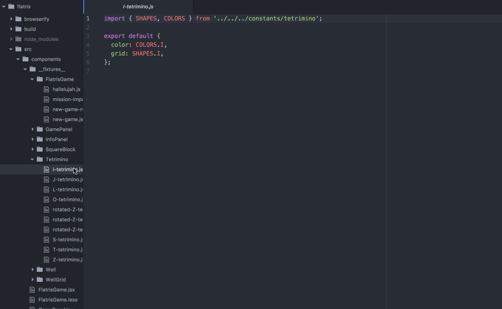
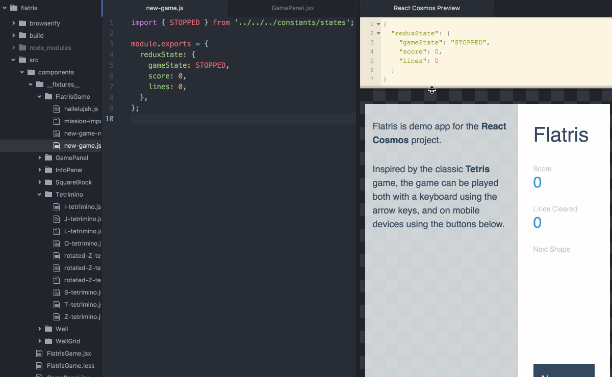

# React Cosmos Atom

Render React components next to your code with `ctrl-shift-r`!

**Warning: This is a working prototype, not a mature package. If you find this cool then let's make it happen together!**





Try it out:

1. Install Atom package
```bash
git clone git@github.com:react-cosmos/react-cosmos-atom.git
cd react-cosmos-atom
npm i
ln -s "$(pwd)" ~/.atom/dev/packages/react-cosmos
```

2. Start React Cosmos server
```bash
git clone git@github.com:react-cosmos/react-cosmos.git
cd react-cosmos
npm i
cd examples/flatris
npm i
npm start
```

3. Start Atom in development mode
```bash
# Open a new terminal in the same dir from Step 2.
atom -d .
```

4. Open a fixture file inside Atom (from `__fixtures__/`) and toggle React Cosmos using `ctrl-shift-r` or from *Packages > React Cosmos*
